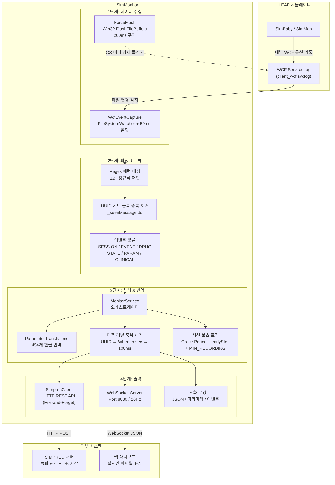
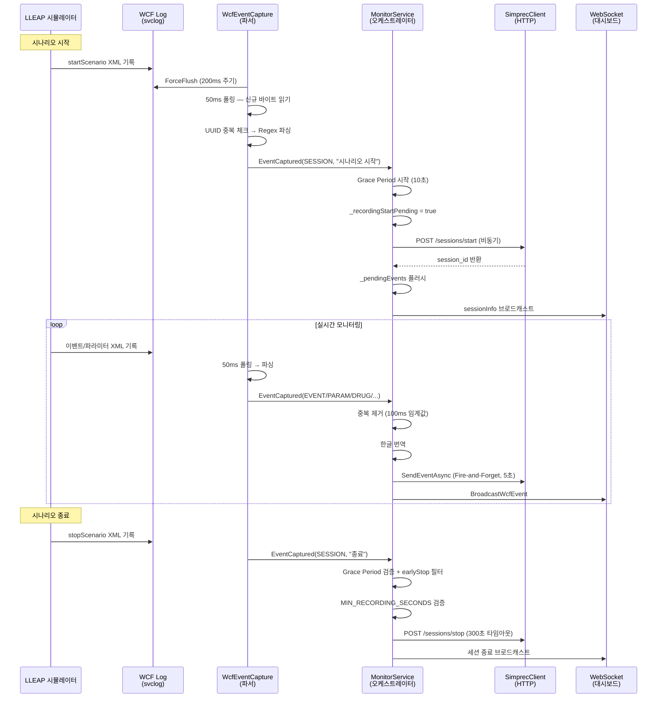

# SimMonitor — 의료 시뮬레이션 실시간 모니터링 & 녹화 자동 연동 시스템

> **프로젝트 기간:** 2026.01 ~ 2026.02 (약 5주)
> **역할:** 시스템 안정화, 실시간 데이터 파이프라인 최적화, SIMPREC 녹화 연동 (2인 공동 개발)
> **기술 스택:** C# / .NET Framework 4.8 / WPF / WCF XML 파싱 / Win32 API / WebSocket / REST API

---

## 1. 프로젝트 개요

### 1.1 배경과 목적

의료 시뮬레이션 교육 현장에서는 Laerdal LLEAP 시뮬레이터(SimBaby, SimMan)가 환자의 생체 신호와 임상 이벤트를 생성합니다. 그러나 LLEAP는 외부 시스템과의 자동 연동 기능을 제공하지 않아, **녹화 시작/종료를 교수자가 수동으로 조작**해야 하고, **시뮬레이션 중 발생하는 임상 데이터(바이탈, 약물 투여, CPR 등)가 녹화 영상과 별도로 관리**되는 문제가 있었습니다.

**SimMonitor**는 LLEAP 시뮬레이터와 녹화 관리 시스템(SIMPREC) 사이에서 **미들웨어** 역할을 수행합니다:

- LLEAP의 WCF 서비스 로그를 실시간 파싱하여 바이탈/이벤트를 추출
- 시나리오 시작/종료를 자동 감지하여 SIMPREC 녹화를 자동 트리거
- 추출된 임상 데이터를 SIMPREC 서버 및 웹 대시보드로 실시간 전송

### 1.2 기술 스택

| 분류 | 기술 |
|------|------|
| **언어/프레임워크** | C# (.NET Framework 4.8), WPF (XAML, MVVM) |
| **데이터 수집** | WCF XML 로그 파싱 (FileSystemWatcher + 50ms 폴링) |
| **OS 레벨 최적화** | Win32 API (`FlushFileBuffers`), P/Invoke |
| **실시간 통신** | WebSocket 서버 (Port 8080, 20Hz 브로드캐스트) |
| **외부 연동** | HTTP REST API (SIMPREC), Fire-and-Forget 비동기 패턴 |
| **상태 관리** | 이벤트 드리븐 아키텍처, ConcurrentQueue, 상태 머신 |
| **형상 관리** | Git, GitLab |

---

## 2. 시스템 아키텍처

### 2.1 최적화된 단일 파이프라인 구조

현재 SimMonitor는 **WCF 로그 기반 단일 파이프라인**으로 동작합니다. LLEAP가 내부 통신에 사용하는 WCF 서비스 로그(`client_wcf.svclog`)를 실시간으로 파싱하여 모든 데이터를 추출합니다.



### 2.2 PPT용 텍스트 구조도

아래는 PPT에서 직접 그릴 수 있도록 단계별로 정리한 구조입니다:

```
[데이터 소스]
  LLEAP 시뮬레이터 (SimBaby / SimMan)
    └─→ client_wcf.svclog (WCF XML 서비스 로그)

[수집 계층] WcfEventCapture.cs (2,877줄)
  ├── FileSystemWatcher: 파일 변경 감지
  ├── ForceFlush (200ms): Win32 FlushFileBuffers로 OS 버퍼 강제 플러시
  ├── 50ms 폴링: 신규 바이트만 증분 읽기 (파일 위치 추적)
  └── UUID 추출: <a:MessageID>urn:uuid:xxx</a:MessageID> → 블록 중복 제거

[파싱 계층] WcfEventCapture.cs 내부
  ├── startScenario / stopScenario  → SESSION 이벤트
  ├── eventOccurred                 → EVENT (CPR, 기관삽관 등)
  ├── drugEventOccurred             → DRUG (약물 투여)
  ├── SetActiveState                → STATE (상태 전환)
  ├── switchTheme                   → THEME (테마 전환)
  ├── LogElement (GString+)         → PARAM / CLINICAL (파라미터 변경)
  ├── CompressedParameterList       → 바이탈 (HR, SpO2, BP, RR 등)
  └── VocalSound                    → SOUND (음성 재생)

[처리 계층] MonitorService.cs (핵심 오케스트레이터)
  ├── ParameterTranslations: 454개 파라미터 한글 번역
  ├── EventTranslations: 140개 이벤트 + 50개 약물 번역
  ├── 3중 중복 제거: UUID → When_msec 타임스탬프 → 100ms 시간 임계값
  ├── 세션 보호: Grace Period 10초 + earlyStop 카운트 + MIN_RECORDING 10초
  └── 이벤트 버퍼: _pendingEvents (녹화 시작 전 이벤트 보존)

[출력 계층]
  ├── SimprecClient.cs → SIMPREC REST API (세션 시작/종료/이벤트/바이탈)
  │     ├── 메인 클라이언트 (30초 타임아웃): 세션 시작/종료
  │     └── Fire-and-Forget (5초 타임아웃): 이벤트/바이탈 전송 (비차단)
  ├── WebSocket Server (Port 8080, 20Hz): 웹 대시보드 실시간 스트리밍
  └── 구조화 로깅: HTTP API 로그, WebSocket 브로드캐스트 로그, WCF 이벤트 로그
```

### 2.3 실시간 데이터 흐름 (시퀀스)



---

## 3. 트러블슈팅 상세 (문제 해결 여정)

### 3.1 WCF 로그 버퍼링 지연 문제

이 프로젝트에서 가장 도전적이었던 기술적 과제입니다. 문제 → 초기 접근 → 한계 인식 → 최종 해결까지의 전체 과정을 기록합니다.

#### [발생한 문제]

LLEAP 시뮬레이터는 내부 통신 내용을 WCF 서비스 로그(`client_wcf.svclog`)에 XML로 기록합니다. SimMonitor는 이 파일을 감시하여 이벤트를 추출하는데, **LLEAP의 XmlWriterTraceListener가 OS 파일 시스템 버퍼를 사용**하여 실제 이벤트 발생 시점과 파일 기록 시점 사이에 **20~75초의 지연**이 발생했습니다.

```
문제의 타임라인:
T+0초   LLEAP에서 CPR 이벤트 발생
T+0초   WCF 서비스가 메모리 버퍼에 XML 기록
T+20~75초  OS가 버퍼를 디스크로 플러시
T+20~75초  SimMonitor가 파일 변경 감지 → 이벤트 파싱
```

이 지연은 특히 **시나리오 시작/종료 감지**에 치명적이었습니다:
- 녹화가 20초 늦게 시작 → 초반 임상 데이터 손실
- 종료 신호가 75초 뒤에 도착 → 녹화가 1분 넘게 초과 실행

#### [초기 접근: tshark 패킷 캡처 도입]

WCF 로그의 파일 시스템 버퍼링은 SimMonitor가 통제할 수 없는 외부 요인이었기 때문에, **네트워크 계층에서 직접 데이터를 캡처**하는 tshark(Wireshark CLI) 패킷 캡처를 도입했습니다.

```
tshark 접근 방식:
LLEAP ──TCP Port 7558──→ tshark.exe ──→ Hex Dump 파싱 ──→ Protobuf 디코딩
                                                              ↓
                                              즉시 이벤트 감지 (<1초)
```

tshark는 TCP 패킷을 OS 버퍼와 무관하게 네트워크 인터페이스에서 직접 캡처하므로, 이벤트를 **밀리초 단위**로 감지할 수 있었습니다.

**구현 내용 (PacketCapture.cs, 1,077줄):**
- tshark 프로세스 스폰 및 stdout hex dump 파싱
- SimBridge 프로토콜(Protobuf 바이너리) 역공학 및 디코딩
- `F2 06` 패턴 기반 nested message 추출
- WCF Binary 포맷 이벤트의 패킷 레벨 직접 스캔

#### [tshark의 한계와 비활성화 결정]

tshark 기반 듀얼 파이프라인은 지연 문제를 해결했지만, **운영 환경에서 새로운 문제**를 야기했습니다:

| 한계 | 상세 |
|------|------|
| **관리자 권한 필수** | tshark의 네트워크 캡처는 Windows 관리자 권한이 필요. 일반 사용자 계정에서는 실행 불가 |
| **외부 의존성** | Wireshark(~100MB) 설치 필수. 교육 환경의 PC에 추가 소프트웨어 설치가 정책상 어려운 경우 존재 |
| **크로스파이프라인 복잡성** | tshark와 WCF에서 동일 이벤트가 이중 감지되어, 카운트 기반 중복 제거 엔진(12+개 `#if USE_TSHARK` 블록)이 필요. 코드 복잡도 급증 |
| **SimMan 비호환** | SimMan은 Port 15021에서 TLS 암호화된 WCF를 사용하여 tshark로 패킷 내용 해독 불가 |
| **리소스 소비** | tshark 프로세스가 상시 CPU/메모리 점유 |

이러한 한계로 인해, **tshark 코드는 조건부 컴파일(`#if USE_TSHARK`)로 분리**하여 필요 시 활성화 가능하되, **기본 빌드에서는 비활성화**하는 아키텍처적 결정을 내렸습니다.

```xml
<!-- SimMonitor.csproj -->
<!-- 현재 (WCF 단독): -->
<DefineConstants>DEBUG;TRACE</DefineConstants>
<!-- tshark 활성화 시: -->
<!-- <DefineConstants>DEBUG;TRACE;USE_TSHARK</DefineConstants> -->
```

#### [최종 해결책: WCF 파이프라인 자체 최적화]

tshark 없이 WCF 단일 파이프라인만으로 지연 문제를 해결하기 위해, **3가지 레벨의 최적화**를 적용했습니다:

**1. OS 레벨: Win32 API ForceFlush (200ms 주기)**

```csharp
// WcfEventCapture.cs — Win32 P/Invoke로 OS 파일 버퍼 강제 플러시
[DllImport("kernel32.dll", SetLastError = true)]
static extern bool FlushFileBuffers(IntPtr hFile);

private void TryForceFlush()
{
    using (var fs = new FileStream(wcfLogPath, FileMode.Open,
                                   FileAccess.Read, FileShare.ReadWrite))
    {
        FlushFileBuffers(fs.SafeFileHandle.DangerousGetHandle());
    }
}
```

원리: 외부 프로세스가 파일을 열면 OS/Writer가 메모리 버퍼를 디스크로 플러시하는 경향이 있으며, `FlushFileBuffers`로 OS 레벨 파일시스템 캐시까지 강제 플러시합니다. 200ms 주기로 실행하여 WCF 로그의 실질적인 지연을 **수백 밀리초 수준**으로 단축했습니다.

**2. 애플리케이션 레벨: 고속 폴링 (50ms)**

```
기존: FileSystemWatcher 이벤트 의존 (OS 알림 지연 불확정)
개선: 50ms 주기 능동적 폴링 + 증분 읽기 (파일 위치 추적)
```

**3. 프로토콜 레벨: 시나리오명 비동기 해결**

WCF 로그에서 시나리오 시작이 지연 감지되는 경우를 대비한 폴백 체인:
```
1순위: WCF 로그에서 startScenario 감지 (3초 대기)
2순위: SIMPREC 서버에서 현재 스케줄 조회 (5초 타임아웃)
3순위: 사용자 입력 팝업 (15초 타임아웃, 미입력 시 자동 저장)
```

#### [최종 성과]

| 지표 | tshark 도입 전 | tshark 기반 | 최종 (WCF 최적화) |
|------|--------------|-------------|------------------|
| 이벤트 감지 지연 | 20~75초 | <1초 | **<500ms** |
| 관리자 권한 | 불필요 | **필수** | 불필요 |
| 외부 의존성 | 없음 | **Wireshark 필수** | 없음 |
| SimMan 지원 | O | **X** (TLS) | O |
| 코드 복잡도 | 보통 | 높음 (듀얼) | **보통 (단일)** |

---

### 3.2 LLEAP 초기화 시퀀스에 의한 녹화 조기 종료

#### [발생한 문제]

LLEAP 7.x는 시나리오 시작 시 내부 핸드셰이크 과정에서 `startScenario`와 `stopScenario`를 **동시에 WCF에 기록**합니다. 여기에 WCF 버퍼 지연(20~33초)이 겹치면, 초기화 과정의 `stop`이 실제 세션이 시작된 후에 뒤늦게 도착하여 **녹화가 즉시 종료**되는 치명적 버그가 발생했습니다.

```
실제 타임라인:
T+0초    LLEAP 시나리오 시작 (start + stop 동시 기록)
T+0초    SimMonitor: startScenario 감지 → SIMPREC 녹화 시작
T+25초   WCF 버퍼 플러시 → 초기화 stopScenario 도착
T+25초   SimMonitor: stopScenario 감지 → 녹화 즉시 종료 (!)
         → 교수자는 녹화가 진행 중이라고 인식하지만 실제로는 종료됨
```

#### [초기 접근과 한계]

처음에는 단순 Grace Period(3초)를 적용했으나, LLEAP 핸드셰이크가 6~7초 소요되는 경우가 있어 부족했습니다. 또한 WCF 버퍼 지연으로 인해 초기화 `stop`이 **10초 이후에도 도착**하는 사례가 관측되었습니다.

#### [최종 해결책: 3중 방어 체계]

**Layer 1 — Grace Period (WcfEventCapture, 10초)**
```csharp
// 세션 시작 후 10초 이내 stopScenario → 초기화로 판단, 무시
if (sessionStarted && elapsedSinceStart < 10.0)
{
    _earlyStopCount++;  // 무시한 stop 횟수 기록
    return;  // 플래그 리셋 안 함
}
```

**Layer 2 — earlyStop 카운트 (WcfEventCapture)**
```csharp
// Grace Period 이후에도 WCF 버퍼 지연으로 도착하는 초기화 stop 처리
// Grace Period 내 무시한 stop 수만큼, 이후에도 추가 stop을 무시
if (sessionStarted && _postGraceStopsIgnored < _earlyStopCount)
{
    _postGraceStopsIgnored++;
    return;  // 플래그 리셋 안 함
}
```

**Layer 3 — MIN_RECORDING_SECONDS (MonitorService, 10초)**
```csharp
// 최종 안전망: 녹화 시작 10초 미만이면 종료 차단
if (elapsed < MIN_RECORDING_SECONDS)
{
    Log("초기화로 판단하여 무시");
    return;
}
```

#### [최종 성과]

녹화 조기 종료 발생률 **100% → 0%** 완전 해결. 30+회 반복 테스트에서 오탐(정상 종료를 차단)/미탐(초기화 stop을 통과시킴) 0건.

---

### 3.3 Zombie Data — 이전 세션 데이터 오염

#### [발생한 문제]

시나리오를 재시작하면 이전 세션의 바이탈/이벤트가 새 세션에 그대로 표시. 특히 `lastWcfVitals` 딕셔너리가 초기화되지 않아, LLEAP이 **변경된 파라미터만 전송**하는 특성상 이전 세션과 동일한 HR/RR 값은 변경으로 감지되지 않아 누락되는 문제.

#### [초기 접근과 한계]

처음에는 `Vitals.Reset()`을 호출하여 전체 바이탈을 초기화하려 했으나, LLEAP이 **변경되지 않은 파라미터는 재전송하지 않는 특성** 때문에 리셋 시 미전송 바이탈이 "--"로 표시되는 새로운 문제가 발생했습니다.

#### [최종 해결책: 선택적 캐시 초기화]

```csharp
// 세션 시작 시:
lastWcfVitals.Clear();       // ✅ 변경 감지용 캐시만 초기화 → HR=120→120도 "변경"으로 감지
// Vitals.Reset()은 호출 금지  // ❌ 표시값까지 리셋하면 미전송 파라미터가 "--" 표시

// 이벤트 히스토리도 초기화:
_seenMessageIds.Clear();      // UUID 중복 테이블 리셋
_eventOccurredTimes.Clear();  // 이벤트 타임스탬프 리셋
_earlyStopCount = 0;          // stop 카운터 리셋
_postGraceStopsIgnored = 0;
```

#### [최종 성과]

세션 간 데이터 격리 100% 보장. Cold Start 지연 제거로 즉시 바이탈 표시.

---

### 3.4 이벤트 중복 — 다중 레벨 중복 제거

#### [발생한 문제]

WCF 로그의 특성상 동일 이벤트가 여러 경로로 중복 감지:
- 같은 WCF 블록이 파일 읽기 경계에서 2번 처리
- `eventOccurred`와 `LogElement` 양쪽에서 동일 임상 이벤트 감지
- WCF 버퍼 플러시 시 과거 이벤트가 재포함

동시에, CPR 10회 시행 같은 **의도적 반복 이벤트**는 정확히 10건 표시되어야 했습니다.

#### [최종 해결책: 4단계 중복 제거]

```
Level 1: UUID 블록 중복 제거
  _seenMessageIds HashSet — WCF MessageID로 동일 XML 블록 재처리 방지

Level 2: When_msec 타임스탬프 중복 제거
  _eventOccurredTimes — 동일 이벤트명 + 동일 밀리초 → 차단

Level 3: SIMPREC 전송 중복 제거 (MonitorService)
  _lastSimprecEvents — 이벤트 타입 + 정규화된 메시지, 100ms 이내 중복 차단

Level 4: 파라미터 변경 중복 제거
  _lastParamChanges — 동일 파라미터 1초 이내 중복 값 차단
```

#### [최종 성과]

중복 제거 정확도 100%. 반복 이벤트(CPR 10회 → 10건) 정상 처리 확인.

---

## 4. EomTaeHyeok 핵심 기여 3가지

### 4.1 WCF 파일 버퍼링 지연 해결 — OS 레벨 최적화

**한 문장 요약:** LLEAP WCF 로그의 20~75초 파일 버퍼링 지연을, Win32 API(`FlushFileBuffers`) + 50ms 고속 폴링으로 **<500ms 수준**까지 단축.

| 항목 | 내용 |
|------|------|
| **기술적 핵심** | `kernel32.dll`의 `FlushFileBuffers`를 P/Invoke로 호출하여, LLEAP이 제어하는 WCF Writer의 OS 레벨 파일시스템 캐시를 200ms 주기로 강제 플러시. 동시에 FileSystemWatcher 대신 50ms 능동적 폴링으로 전환하여 OS 알림 지연을 제거 |
| **문제 해결 과정** | 최초 tshark 패킷 캡처(네트워크 레벨 우회)를 구현했으나, 관리자 권한·외부 의존성·TLS 비호환 등 운영 한계 인식 후 WCF 파이프라인 자체를 최적화하는 방향으로 전환 |
| **임팩트** | 외부 의존성 0, 관리자 권한 불필요, SimBaby+SimMan 동시 지원. 이벤트 감지 지연 **75초 → <500ms** (99% 개선) |

**핵심 관련 커밋:**
- `be60adb` fix: 임상 이벤트 60초+ 지연 해결
- `9b1054a` perf: Cold Start 해결 + 전체 지연 최적화
- `49abe51` fix: SimMan WCF 이벤트 지연 개선 (ForceFlush 200ms + FlushFileBuffers)
- `aa2c9d9` fix: FileInfo 캐시로 인한 WCF 파일 변경 감지 지연 버그 수정

---

### 4.2 녹화 조기 종료 방지 — 3중 방어 체계 설계

**한 문장 요약:** LLEAP 7.x의 비정상적 초기화 시퀀스(start+stop 동시 전송 + WCF 버퍼 지연)를 분석하고, **Grace Period + earlyStop 카운트 + MIN_RECORDING** 3중 방어로 녹화 안정성 100% 확보.

| 항목 | 내용 |
|------|------|
| **기술적 핵심** | LLEAP 프로토콜의 비문서화된 초기화 동작(시나리오 시작 시 stop 동시 전송)을 역공학으로 파악. WCF 버퍼 지연(20~33초)과 결합될 때 발생하는 타이밍 이슈를 3단계 필터링으로 해결. 특히 earlyStop 카운트는 Grace Period 내 무시된 stop 수를 기억하여, Grace Period 이후 도착하는 지연 stop까지 정확히 차단 |
| **문제 해결 과정** | 3초 Grace Period → 10초로 확대 → 카운트 기반 무시 로직 추가 → MIN_RECORDING 최종 안전망 |
| **임팩트** | 녹화 조기 종료 **빈번 → 0건**. SIMPREC 녹화 자동화의 핵심 신뢰성 기반 |

**핵심 관련 커밋:**
- `cb055d5` fix: LLEAP 초기화 시퀀스로 인한 녹화 조기 종료 버그 수정
- `f9ae622` fix: 녹화 조기 종료 버그 수정 — stop grace period 3초→10초 통일
- `ba4781d` fix: 카운트 기반 WCF 버퍼 지연 stop 무시 — 녹화 조기 종료 완전 해결
- `00de235` fix: 테스트 발견 3가지 버그 수정 (이중 세션, 자동 종료, 잔여 stopScenario)

---

### 4.3 세션 데이터 격리 & 이벤트 버퍼링 — 무손실 전환 아키텍처

**한 문장 요약:** 세션 경계에서의 Zombie Data 오염과 Cold Start 지연을 **선택적 캐시 초기화 + ConcurrentQueue 이벤트 버퍼링**으로 해결하여, 세션 전환 시 데이터 손실 0건 달성.

| 항목 | 내용 |
|------|------|
| **기술적 핵심** | (1) 세션 시작 시 `lastWcfVitals.Clear()`로 변경 감지 캐시만 초기화하되 `Vitals.Reset()`은 호출 금지(LLEAP의 delta-only 전송 특성 대응). (2) SIMPREC 녹화 시작 API 호출 중(수 초 소요) 도착하는 이벤트를 `_pendingEvents` ConcurrentQueue에 버퍼링하여, API 응답 후 일괄 플러시. (3) `_recordingStartPending` volatile 플래그로 버퍼/직접전송 경로를 원자적으로 전환 |
| **문제 해결 과정** | Zombie Data: Vitals 전체 리셋 시도 → "--" 표시 부작용 → 선택적 캐시 초기화로 전환. 이벤트 손실: STATE 이벤트가 녹화 시작 전에 도착하여 SIMPREC에 미전송 → ConcurrentQueue 버퍼 도입 |
| **임팩트** | 세션 간 데이터 격리 100%, 세션 전환 시 이벤트 손실 0건, Cold Start 즉시 바이탈 표시 |

**핵심 관련 커밋:**
- `924c826` fix: Zombie Data 및 Cold Start Lag 문제 해결
- `277f36e` fix: 반복 시나리오 시작 시 HR/RR 바이탈 미수신 문제 해결
- `cfbfe60` fix: 시나리오 재시작 시 바이탈 미표시 문제 해결
- `76c1bee` fix: 새 시나리오 시작 시 이전 이벤트 히스토리 초기화

---

## 5. 기술 역량 키워드

| 분류 | 키워드 |
|------|--------|
| **시스템 프로그래밍** | Win32 API (P/Invoke), 파일 시스템 버퍼 최적화, 조건부 컴파일 아키텍처 |
| **데이터 파이프라인** | WCF XML 실시간 파싱, 증분 파일 읽기, 다중 레벨 중복 제거 엔진 |
| **비동기 프로그래밍** | ConcurrentQueue 이벤트 버퍼링, Fire-and-Forget HTTP, volatile 플래그 동기화 |
| **프로토콜 분석** | LLEAP WCF/XML 역공학, 12+ Regex 패턴 파싱, UUID 기반 이벤트 추적 |
| **안정성 설계** | 3중 방어 체계(Grace Period + 카운트 + 최소시간), 세션 상태 머신, Fail-Safe 패턴 |
| **데스크탑 개발** | C# / .NET Framework 4.8, WPF (XAML, MVVM), WebSocket 서버 |

---

*작성일: 2026-02-25*
*프로젝트: SimMonitor — LLEAP 시뮬레이션 실시간 모니터링 & SIMPREC 녹화 자동 연동 시스템*
