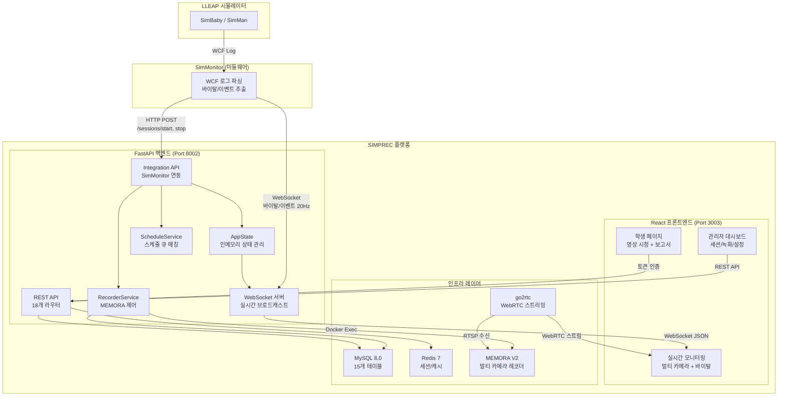
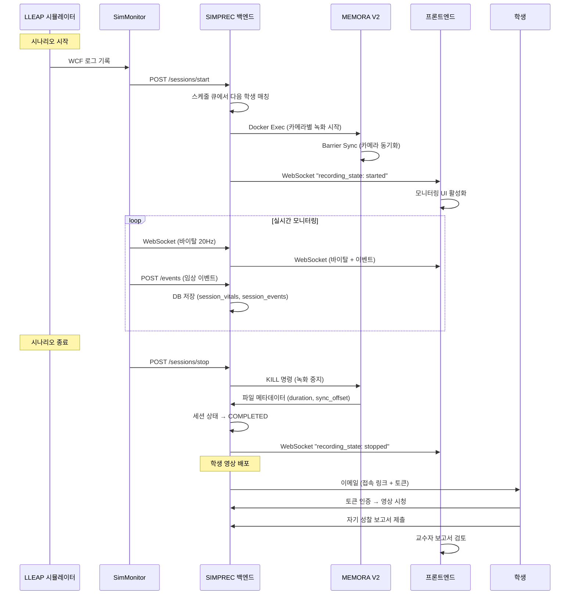
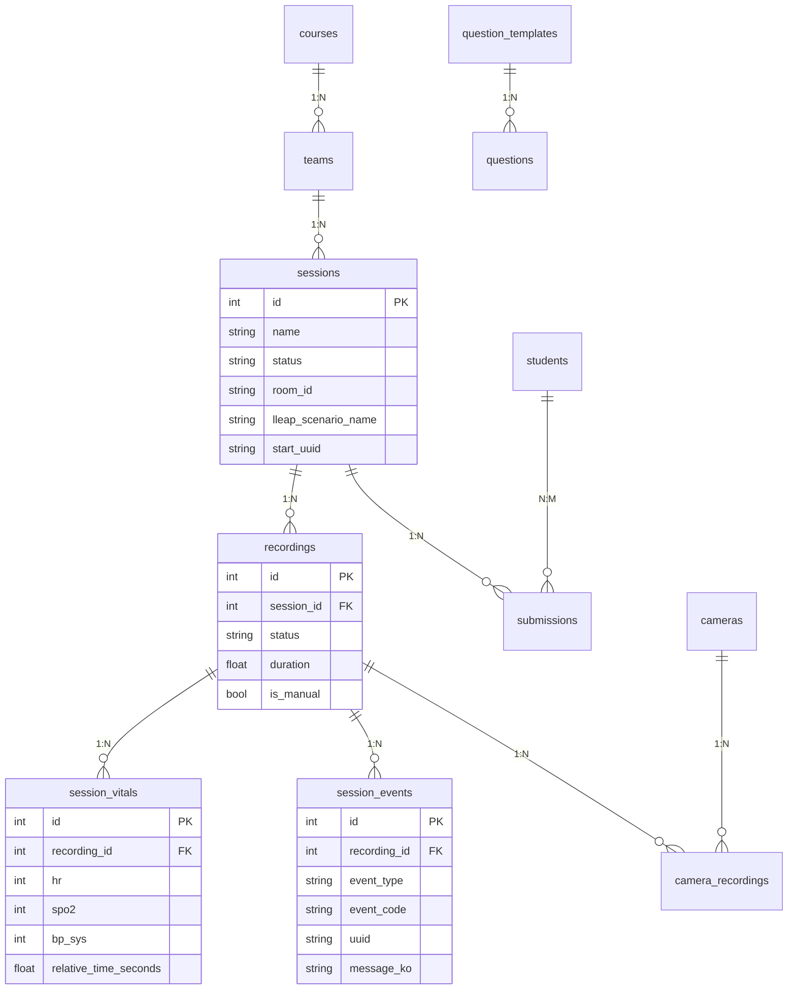

# SIMPREC — 의료 시뮬레이션 녹화 및 학습 관리 플랫폼

> **프로젝트 기간:** 2026.01 ~ 2026.02 (약 5주)
> **역할:** 풀스택 개발 — 프론트엔드 UI/UX, 백엔드 실시간 연동, 인프라 구축 (2인 공동 개발)
> **기술 스택:** React 19 / FastAPI / MySQL / Docker / WebSocket / WebRTC / MEMORA V2

---

## 1. 프로젝트 개요

### 1.1 배경과 목적

의료 시뮬레이션 교육에서는 마네킹 시뮬레이터(SimBaby, SimMan)를 활용한 시나리오 훈련이 핵심입니다. 그러나 기존 환경에서는:

- 녹화 시작/종료를 **교수자가 수동으로 조작**해야 하고
- 영상과 **바이탈 사인/임상 이벤트가 별도로 관리**되며
- 학생이 녹화 영상을 보며 **자기 성찰 보고서를 제출하는 프로세스**가 수기로 진행

**SIMPREC**은 이 전체 워크플로우를 디지털화한 웹 기반 플랫폼입니다:

| 기능 | 설명 |
|------|------|
| **자동 녹화 제어** | LLEAP 시나리오 시작/종료를 자동 감지하여 멀티 카메라 동시 녹화 |
| **실시간 모니터링** | WebRTC 스트리밍 + 바이탈/이벤트 실시간 표시 |
| **멀티 카메라 동기화** | MEMORA V2 레코더로 카메라 간 100μs 미만 동기화 |
| **학생 학습 관리** | 녹화 영상 배포, 질문 템플릿, 자기 성찰 보고서 제출/관리 |
| **스케줄 기반 큐** | 수업 일정에 따라 학생/팀별 자동 세션 매칭 |

### 1.2 기술 스택

| 분류 | 기술 |
|------|------|
| **프론트엔드** | React 19, TypeScript 5, Vite 7, TailwindCSS 3, Zustand 5 |
| **백엔드** | Python 3.11+, FastAPI, SQLAlchemy 2 (AsyncIO), Pydantic |
| **데이터베이스** | MySQL 8.0, Redis 7 (세션/캐시) |
| **녹화** | MEMORA V2 (C 기반 멀티 카메라 RTSP 레코더, Barrier Sync) |
| **스트리밍** | go2rtc (WebRTC/RTSP 브릿지) |
| **실시간 통신** | WebSocket (바이탈/이벤트 스트리밍, 녹화 상태 브로드캐스트) |
| **외부 연동** | SimMonitor REST API + WebSocket (LLEAP 시뮬레이터 데이터) |
| **인프라** | Docker Compose (6개 컨테이너), Alembic (DB 마이그레이션) |

---

## 2. 시스템 아키텍처

### 2.1 전체 시스템 구조



### 2.2 PPT용 텍스트 구조도

```
[외부 시스템]
  LLEAP 시뮬레이터 → SimMonitor (C# 미들웨어)
    └─→ HTTP: 세션 시작/종료 트리거, 이벤트 전송
    └─→ WebSocket: 바이탈 사인 20Hz 실시간 스트리밍

[백엔드] FastAPI (Python)
  ├── Integration API: SimMonitor 연동 (세션 자동 시작/종료)
  ├── Recording API: 녹화 제어 (MEMORA 명령 큐)
  ├── Session API: 세션 CRUD + 스케줄 큐 매칭
  ├── WebSocket Server: 프론트엔드 실시간 브로드캐스트
  ├── Student Access API: 토큰 기반 학생 영상 접근
  └── ScheduleService: 수업 일정 → 자동 세션 생성

[프론트엔드] React 19 + TypeScript
  ├── 관리자: 대시보드, 세션 관리, 실시간 모니터링, 녹화 재생, 설정
  ├── 학생: 토큰 인증, 영상 시청, 자기 성찰 보고서 제출
  └── 공통: 멀티 카메라 동기화 플레이어, 바이탈 패널, 이벤트 로그

[녹화 계층]
  ├── MEMORA V2: C 기반 멀티 카메라 RTSP → MP4 레코더
  │     ├── Barrier Sync FSM: 카메라 간 100μs 동기화
  │     └── Warm Buffer: 10초 프리롤 (프레임 손실 방지)
  └── go2rtc: RTSP → WebRTC 브릿지 (실시간 스트리밍)

[데이터 계층]
  ├── MySQL 8.0: 15개 테이블 (세션, 녹화, 이벤트, 바이탈, 학생, 스케줄 등)
  └── Redis 7: 세션 캐시, WebSocket 상태
```

### 2.3 녹화 워크플로우 (시퀀스)



---

## 3. 상세 작업 내역 (BaeChaeEun)

BaeChaeEun은 eth-simprec 프로젝트에서 **프론트엔드 전체 구현 및 풀스택 기능 개발**을 담당했습니다.
(bce 브랜치 118커밋 + eth 브랜치 18커밋 = **총 136커밋**)

### 3.1 실시간 모니터링 대시보드 구현

| 항목 | 내용 |
|------|------|
| **구현 내용** | 멀티 카메라 WebRTC 스트리밍, 바이탈 사인 패널(HR/SpO2/BP/RR/Temp/EtCO2), 임상 이벤트 로그(기본/상세 토글), ECG 파형 표시를 통합한 실시간 모니터링 페이지 구현. WebSocket 훅(`useVitalsWebSocket`)으로 20Hz 데이터 수신 |
| **해결한 문제** | 여러 데이터 소스(WebRTC 영상, WebSocket 바이탈, HTTP 이벤트)를 단일 화면에 동기화하여 표시하는 UX 문제. 이벤트 로그의 정보 과부하를 기본/상세 뷰 토글로 해결 |
| **성과** | 교수자가 시뮬레이션 진행 중 **한 화면에서** 영상 + 바이탈 + 이벤트를 실시간 확인 가능 |

### 3.2 멀티 카메라 동기화 플레이어 (SyncVideoPlayer)

| 항목 | 내용 |
|------|------|
| **구현 내용** | MEMORA V2가 기록한 카메라별 PTS 오프셋(`sync_offset_us`)을 활용하여, 최대 4대 카메라 영상을 **50ms 이내 동기화**로 재생하는 SyncVideoPlayer 컴포넌트 구현. Anchor 카메라 기준 상대 재생 위치 계산 |
| **해결한 문제** | 카메라별 녹화 시작 시점이 미세하게 다른데(RTSP 스트림 지연), 단순 동시 재생 시 수 초 어긋나는 문제. MEMORA의 마이크로초 단위 동기화 메타데이터를 프론트엔드에서 활용 |
| **성과** | 교수자/학생이 녹화 재생 시 **모든 카메라가 정확히 같은 시점**을 표시. 시뮬레이션 디브리핑 품질 향상 |

### 3.3 학생 학습 관리 시스템 (풀스택)

| 항목 | 내용 |
|------|------|
| **구현 내용** | 학생 토큰 인증, 영상 시청 페이지, 질문 템플릿 빌더, 자기 성찰 보고서 제출/검토 기능을 프론트엔드+백엔드 양쪽에서 구현. 이메일 템플릿 에디터(tiptap WYSIWYG)로 학생 초대 메일 커스터마이징 지원 |
| **해결한 문제** | 기존 수기 프로세스(영상 USB 배포 → 종이 보고서 → 수동 수합)를 웹 기반으로 디지털화. CSV 일괄 업로드로 학생 등록 효율화 |
| **성과** | 녹화 영상 배포부터 보고서 제출·검토까지 **전 과정 온라인화**. 교수자 운영 시간 대폭 단축 |

### 3.4 세션 관리 및 스케줄 큐 시스템

| 항목 | 내용 |
|------|------|
| **구현 내용** | 코스/팀/학생 기반 세션 생성 UI, 스케줄 큐 자동 매칭(LLEAP 시나리오 시작 시 다음 대기 학생 자동 연결), 세션 상태 머신(waiting → recording → completed), 팀 선택 시 자동 Submission 생성 |
| **해결한 문제** | 교수자가 매 세션마다 학생 정보를 수동 입력하는 비효율. 스케줄 순서대로 자동 매칭하여 운영 간소화 |
| **성과** | 하루 20+세션 운영 시 세션별 학생 매칭이 **완전 자동화** |

### 3.5 인프라 및 배포 환경 구축

| 항목 | 내용 |
|------|------|
| **구현 내용** | Docker Compose 기반 6개 서비스(Backend, Frontend, MySQL, Redis, go2rtc, Recorder) 통합 환경 구축. 환경변수 템플릿화(`docker-compose.dev.yml.example`), 컨테이너명 환경변수화, dev.sh 스크립트 |
| **해결한 문제** | 개발/운영 환경 차이로 인한 배포 장애. 환경별 설정이 코드에 하드코딩되어 있던 문제 |
| **성과** | 새 환경에서 `./dev.sh` 한 줄로 전체 시스템 구동. 환경별 설정 분리로 배포 안정성 확보 |

---

## 4. 상세 작업 내역 (EomTaeHyeok)

EomTaeHyeok은 **백엔드 실시간 연동 안정성**과 **데이터 정합성**에 집중했습니다 (6커밋, 핵심 버그 수정).

### 4.1 모니터링 페이지 중간 접속 문제 해결

| 항목 | 내용 |
|------|------|
| **구현 내용** | WebSocket `/ws/vitals` 연결 시 현재 바이탈 상태, 최근 100개 이벤트 히스토리, 녹화 상태, 세션 정보를 즉시 전송하는 초기 상태 동기화 로직 구현 |
| **해결한 문제** | 시뮬레이션 진행 중에 모니터링 페이지를 열면 바이탈/이벤트가 빈 화면으로 표시되는 문제. WebSocket은 연결 이후 데이터만 수신하므로, 이전 상태를 알 수 없었음 |
| **성과** | 모니터링 페이지 언제 접속해도 **즉시 현재 상태 표시** |

### 4.2 이벤트 중복 표시 및 고스트 이벤트 수정

| 항목 | 내용 |
|------|------|
| **구현 내용** | ① HTTP `/events` 엔드포인트와 WebSocket `wcfEvent` 양쪽으로 동일 이벤트가 도착하여 2회 표시되는 중복 제거. ② 세션 시작 시 `room_events` 히스토리를 초기화하여 이전 세션 이벤트(고스트)가 새 세션에 표시되는 문제 해결 |
| **해결한 문제** | 프론트엔드에서 동일 이벤트가 2번 렌더링되는 UX 문제 + 새 세션에서 이전 세션의 CPR/약물 이벤트가 나타나는 데이터 오염 문제 |
| **성과** | 이벤트 표시 정확도 100%, 세션 간 데이터 격리 보장 |

### 4.3 녹화 재생 시 바이탈 데이터 연동

| 항목 | 내용 |
|------|------|
| **구현 내용** | 녹화 재생 페이지에서 `session_vitals` 테이블의 바이탈 시계열 데이터를 영상 타임라인과 동기화하여 표시하는 기능 구현. `relative_time_seconds` 필드로 녹화 시작 시점 기준 상대 시간 계산 |
| **해결한 문제** | 실시간 모니터링 중에는 바이탈이 보이지만, 녹화 재생 시에는 바이탈 데이터가 누락되는 문제. DB 저장 로직(`session_vitals`)과 프론트엔드 재생 로직 간 연결 부재 |
| **성과** | 녹화 재생 시 **영상 + 바이탈 + 이벤트** 통합 디브리핑 가능 |

### 4.4 SessionEvent UUID/EventCode 추적 체계

| 항목 | 내용 |
|------|------|
| **구현 내용** | `session_events` 테이블에 `event_code`(표준화된 이벤트 코드)와 `uuid`(WCF MessageID) 컬럼 추가. SimMonitor에서 전송하는 UUID를 DB까지 보존하여 End-to-End 이벤트 추적 가능 |
| **해결한 문제** | 이벤트의 원본 출처를 역추적할 수 없어 디버깅이 어려운 문제. SimMonitor ↔ SIMPREC 간 이벤트 정합성 검증 불가 |
| **성과** | LLEAP → SimMonitor → SIMPREC 전 구간 이벤트 추적성(Traceability) 확보 |

---

## 5. 기술적 이슈 해결 (Troubleshooting)

### Issue #1: 멀티 소스 실시간 데이터 동기화

| 구분 | 내용 |
|------|------|
| **Issue** | 모니터링 페이지에서 WebRTC 영상(go2rtc), WebSocket 바이탈(SimMonitor), HTTP 이벤트(REST API) 세 가지 데이터 소스가 각각 다른 지연 시간을 가져 화면에서 시간이 어긋남 |
| **Action** | 모든 이벤트에 `relative_time_seconds`(녹화 시작 기준 상대 시간)를 부여하여 단일 타임라인 기준으로 정렬. WebSocket 바이탈은 20Hz로 수신하되 UI 업데이트는 requestAnimationFrame으로 렌더링 최적화. 이벤트는 도착 순서가 아닌 타임스탬프 순서로 정렬 |
| **Result** | 영상-바이탈-이벤트 간 체감 동기화 달성. 모니터링 페이지 CPU 사용량 최적화 |

### Issue #2: WebSocket 중간 접속 시 빈 화면

| 구분 | 내용 |
|------|------|
| **Issue** | 시뮬레이션이 이미 진행 중인 상태에서 모니터링 페이지를 열면, WebSocket 연결 이전의 바이탈/이벤트를 수신할 수 없어 빈 화면 표시 |
| **Action** | WebSocket 연결 시 서버의 `AppState`에서 현재 상태(바이탈 스냅샷, 최근 100개 이벤트, 녹화 상태, 세션 정보)를 즉시 전송하는 초기 동기화 프로토콜 구현 |
| **Result** | 모니터링 페이지 **언제 접속해도 즉시 현재 상태 표시**. 교수자가 교실 이동 중에도 모니터링 재개 가능 |

### Issue #3: 이전 세션 이벤트 오염 (고스트 이벤트)

| 구분 | 내용 |
|------|------|
| **Issue** | 새 시나리오가 시작되었는데, 이전 세션의 "CPR 시작", "약물 투여" 등 이벤트가 이벤트 로그에 그대로 남아 있음. `AppState.room_events`가 세션 경계에서 초기화되지 않았기 때문 |
| **Action** | `/sessions/start` 호출 시 해당 room의 이벤트 히스토리를 완전 초기화. WebSocket 클라이언트에게 `clearHistory: true` 메시지를 전송하여 프론트엔드 이벤트 로그도 동시 초기화 |
| **Result** | 세션 간 이벤트 데이터 격리 100% 보장 |

### Issue #4: MEMORA 녹화 동기화 메타데이터 활용

| 구분 | 내용 |
|------|------|
| **Issue** | 멀티 카메라 녹화 시 카메라별 녹화 시작 시점이 미세하게 달라(RTSP 스트림 지연, Barrier Sync 시간), 단순 동시 재생 시 영상이 최대 수 초 어긋남 |
| **Action** | MEMORA V2의 Barrier State JSON에서 카메라별 `first_pts_sec`(첫 프레임 PTS)와 `sync_offset_us`(앵커 카메라 기준 오프셋)를 파싱하여 `camera_recordings` 테이블에 저장. 프론트엔드 SyncVideoPlayer에서 앵커 카메라 기준으로 각 카메라의 재생 위치를 보정 |
| **Result** | 멀티 카메라 재생 시 **50ms 이내 동기화** 달성 |

### Issue #5: room_id 없는 SimMonitor 호환성

| 구분 | 내용 |
|------|------|
| **Issue** | SimMonitor가 `room_id`를 전송하지 않는 환경(단일 실습실)에서 세션 시작 API가 실패. Integration API가 `room_id`를 필수값으로 요구했기 때문 |
| **Action** | `room_id`를 Optional로 변경. 미전송 시 등록된 첫 번째 SimMonitor의 room_id를 자동 사용하는 폴백 로직 구현. 프론트엔드에서 room_id 입력 UI 제거(불필요한 복잡성 제거) |
| **Result** | 단일 실습실 환경에서도 **설정 없이 즉시 사용 가능** |

---

## 6. 시스템 구성 상세

### 6.1 Docker Compose 서비스 구성

| 서비스 | 컨테이너 | 포트 | 역할 |
|--------|----------|------|------|
| **Backend** | eth-simprec-backend | 8002 | FastAPI API 서버 |
| **Frontend** | eth-simprec-frontend | 3003 | React Vite 개발 서버 |
| **MySQL** | eth-simprec-mysql | 3308 | 관계형 데이터베이스 |
| **Redis** | eth-simprec-redis | 6381 | 세션/캐시 스토어 |
| **go2rtc** | eth-simprec-go2rtc | 1985, 8556 | WebRTC 스트리밍 |
| **Recorder** | eth-simprec-recorder | — | MEMORA V2 녹화 바이너리 |

### 6.2 데이터베이스 핵심 테이블 (15개)



---

## 7. 프로젝트 성과 요약

### 7.1 정량적 성과

| 지표 | Before | After |
|------|--------|-------|
| 녹화 시작/종료 | 수동 조작 | **LLEAP 연동 자동화** |
| 영상 + 바이탈 + 이벤트 | 별도 관리 | **단일 플랫폼 통합** |
| 학생 보고서 프로세스 | 종이/USB 수기 | **웹 기반 자동화** |
| 멀티 카메라 동기화 | 미지원 | **50ms 이내** (MEMORA V2) |
| 학생 매칭 | 수동 입력 | **스케줄 큐 자동 매칭** |
| 실시간 모니터링 | 불가 | **WebRTC + WebSocket 20Hz** |

### 7.2 기술적 성과

- **6개 Docker 컨테이너** 기반 마이크로서비스 아키텍처
- **15개 DB 테이블** 설계 및 Alembic 마이그레이션 관리
- **18개 API 라우터** + WebSocket 실시간 스트리밍
- **풀스택 개발**: React 19 프론트엔드 50+ 컴포넌트 + FastAPI 백엔드

---

## 8. 기술 역량 키워드

| 분류 | 키워드 |
|------|--------|
| **프론트엔드** | React 19, TypeScript, Vite, TailwindCSS, Zustand, WebRTC, WebSocket |
| **백엔드** | FastAPI, SQLAlchemy AsyncIO, Pydantic, WebSocket 서버, REST API 설계 |
| **데이터베이스** | MySQL, Redis, Alembic 마이그레이션, 관계형 스키마 설계 |
| **실시간 시스템** | WebSocket 브로드캐스트, 20Hz 데이터 스트리밍, 이벤트 중복 제거 |
| **인프라** | Docker Compose, 멀티 컨테이너 오케스트레이션, 환경변수 관리 |
| **영상 처리** | 멀티 카메라 동기화 재생, RTSP 스트리밍, PTS 오프셋 보정 |

---

*작성일: 2026-02-25*
*프로젝트: SIMPREC — 의료 시뮬레이션 녹화 및 학습 관리 플랫폼*
