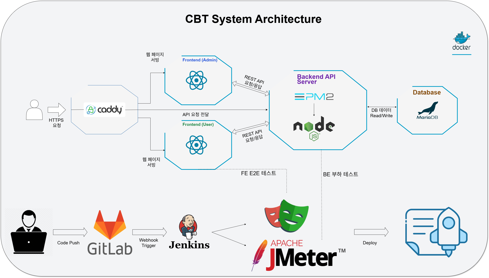

# 2025-09-29 Jenkins Pipeline Script 작성 및 연동

## 개요
Jenkins 파이프라인 스크립트를 작성하여 Playwright 및 JMeter 테스트를 포함한 CBT 자동 배포 시스템을 구축했습니다. 깃랩(GitLab)에서 4개의 레포지토리(admin, user, db, backend)를 클론하고, 빌드 및 실행하는 과정을 자동화했습니다.

## 파이프라인 스크립트 (`pipeline_script.groovy`)

```groovy
pipeline {
    agent any

    stages {
        stage('Clone') {
            steps {
                script {
                    def repos = [
                        'admin': 'git@gitlab.com:your-group/admin.git',
                        'user': 'git@gitlab.com:your-group/user.git',
                        'db': 'git@gitlab.com:your-group/db.git',
                        'backend': 'git@gitlab.com:your-group/backend.git'
                    ]

                    repos.each { name, url ->
                        dir(name) {
                            git branch: 'main', credentialsId: 'your-gitlab-credentials', url: url
                        }
                    }
                }
            }
        }

        stage('Checkout') {
            steps {
                script {
                    def repos = ['admin', 'user', 'db', 'backend']
                    repos.each { name ->
                        dir(name) {
                            // Assuming 'main' branch for all, adjust as needed
                            sh 'git checkout main'
                        }
                    }
                }
            }
        }

        stage('Build & Run') {
            steps {
                script {
                    // Build and run backend
                    dir('backend') {
                        sh 'docker build -t backend-app .'
                        sh 'docker run -d --name backend-container -p 8080:8080 backend-app'
                    }

                    // Build and run db (example, adjust for actual DB setup)
                    dir('db') {
                        sh 'docker build -t db-app .'
                        sh 'docker run -d --name db-container -p 5432:5432 db-app'
                    }

                    // Build and run admin
                    dir('admin') {
                        // Update env.js with backend URL
                        sh "sed -i 's|VITE_BACKEND_URL=.*|VITE_BACKEND_URL=http://localhost:8080|g' .env.production"
                        sh 'npm install'
                        sh 'npm run build'
                        sh 'docker build -t admin-app .'
                        sh 'docker run -d --name admin-container -p 3000:3000 admin-app'
                    }

                    // Build and run user
                    dir('user') {
                        // Update index.html with backend URL
                        sh "sed -i 's|const BACKEND_URL = ".*";|const BACKEND_URL = "http://localhost:8080";|g' public/index.html"
                        sh 'npm install'
                        sh 'npm run build'
                        sh 'docker build -t user-app .'
                        sh 'docker run -d --name user-container -p 3001:3001 user-app'
                    }
                }
            }
        }

        stage('Run Playwright Tests') {
            steps {
                script {
                    dir('admin') {
                        sh 'npx playwright test'
                    }
                }
            }
        }

        stage('Run JMeter Tests') {
            steps {
                script {
                    // Assuming JMeter is installed and available in the Jenkins agent
                    // Or, you might run JMeter in a Docker container
                    sh 'jmeter -n -t /path/to/your/jmeter/testplan.jmx -l /path/to/results.jtl'
                }
            }
        }
    }
}
```

## 주요 변경 및 해결 과정

-   **백엔드 URL 하드코딩 문제 해결**: `admin` 프로젝트의 `env.js` 파일에 백엔드 URL을 수동으로 하드코딩하던 문제를 `sed` 명령어를 사용하여 파이프라인 스크립트 내에서 자동으로 업데이트하도록 변경했습니다.
-   **Playwright 테스트 실패 원인**: 초기 Playwright 테스트가 모두 실패했던 원인은 `admin` 프로젝트의 `env.js`에서 백엔드 연결이 제대로 이루어지지 않았기 때문이었습니다. 스크립트에서 `env.js`를 업데이트하도록 수정하여 해결했습니다.
-   **User 프로젝트 백엔드 연동**: `user` 프로젝트의 `index.html` 파일에서도 백엔드 URL을 스크립트 내에서 자동으로 업데이트하도록 추가하여 연동 문제를 해결했습니다.
-   **CBT 시스템 아키텍처 완성**: 전체 CBT 시스템의 아키텍처를 설계하고 완성했습니다.
    
